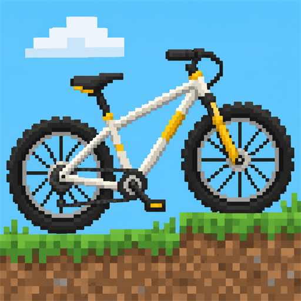
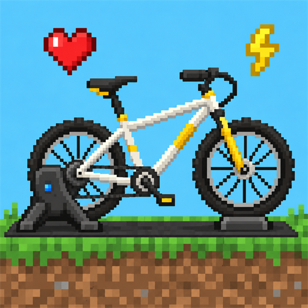

# VoxVelo

VoxVelo is a family of three mods: **VoxVelo Bikes**, **VoxVelo Fitness Library**, and **VoxVelo Fitness**.
The three-mod naming and dependency model below is the target of the upcoming refactor. The code, build outputs
and release workflow still use the previous Bikes and library IDs. This refactor will be a breaking change;
backward compatibility and migration of older installations or saved-world mod data are not provided.

<p align="center">
  
  &nbsp;&nbsp;
  
</p>

Rideable, fully multiplayer bicycles for Minecraft (Fabric). Ride with the keyboard and mouse, or install the
fitness add-on and pedal a real smart trainer (Bluetooth FTMS), steer with OpenBikeControl devices such as the
BikeControl phone app, and record your rides as FIT files.

## Screenshots

<p align="center">
  
</p>
<p align="center">
  
  
  
  
  
  
</p>

## Features

- **Real bicycles:** road, gravel and mountain bikes, crafted from frames, wheels, tires, handlebars, saddles and
  pedals, recolorable with dyes, enchantable with Speed Boost, repaired and dismantled with a wrench.
- **Power-based physics:** rider power against rolling resistance per surface, air drag, slope gravity, braking,
  suspension and fall damage. Bikes climb one-block steps, roll downhill and shove or hurt what they run into.
- **Multiplayer first:** a synchronized entity that rides like a horse or boat. Everyone sees steering, wheels,
  cranks and a posed rider. Works in singleplayer, on LAN and on dedicated servers.
- **Keyboard riding** is always available and fully rebindable.
- **Cycling track generator:** `/voxvelo track` builds a closed, terrain-following loop road with slab slopes,
  borders, tunnels and bridges.
- **Cycling statistics:** Distance Cycled and Time on a Bicycle in the vanilla statistics screen.
- **Fitness add-on:**
  - Smart trainers (Bluetooth FTMS) as propulsion, plus an optional power meter and heart rate sensor.
  - Trainer resistance follows the terrain and the surface, with 12 virtual gears (virtual shifting).
  - OpenBikeControl steering, braking and shifting over the network (mDNS) or Bluetooth LE.
  - Hands-free road following with LEFT / RIGHT prompts at junctions.
  - Riding HUD, heart rate graph and a server-wide rider stats overlay.
  - Ride recording with summaries, FIT export for Strava, Garmin Connect and others, and ride maps.

## The three mods

Each mod has its own jar and is intended to have its own Modrinth entry:

| Jar | Mod ID | Purpose | Requires |
| --- | --- | --- | --- |
| `voxvelo-bikes-<version>.jar` | `voxvelo_bikes` | Bikes, physics, recipes, keyboard riding, tracks | Fabric API, GeckoLib |
| `voxvelo-fitness-lib-<version>.jar` | `voxvelo_fitness_lib` | Reusable Bluetooth/device connections, trainer feedback, HUD, sessions, recording and FIT export | Fabric API |
| `voxvelo-fitness-<version>.jar` | `voxvelo_fitness` | Connects bikes to the fitness library; road following, rider stats and ride maps | Matching VoxVelo Bikes and VoxVelo Fitness Library, plus Fabric API and GeckoLib |

**VoxVelo Bikes** works independently. It contains no Bluetooth support, fitness-device integrations, workout
recording or fitness libraries. Players who just want bicycles only need Bikes and its normal dependencies.

**VoxVelo Fitness Library** is vehicle-independent. Other developers can use its public API to build fitness
integrations for their own vehicles without depending on Bikes, VoxVelo Fitness or GeckoLib. It activates vehicle
feedback and recording samples only when an adapter supports the local player's vehicle.

**VoxVelo Fitness** requires both `voxvelo_bikes` and `voxvelo_fitness_lib`. For bicycle fitness features,
install all three jars from the same release. Bikes and the library do not depend on each other. The library is
an explicit, separately installed dependency of Fitness, not bundled inside its jar.

There is no standalone mod named `voxvelo` or `voxel_fitness` in this model. Modrinth publishing will declare
both required dependencies on the VoxVelo Fitness entry so compatible launchers can resolve them.

Developers: see the [vehicle integration API](docs/fitness-api.md) and the optional
[boat example](examples/fitness-boat/src/main/java/dev/michidk/example/BoatFitness.java).

## Installation

1. Install [Fabric Loader](https://fabricmc.net/use/) 0.19.5 or newer for Minecraft 26.3 and [Fabric API](https://modrinth.com/mod/fabric-api).
2. For bicycles, install [GeckoLib](https://modrinth.com/mod/geckolib) 5.5.7 and `voxvelo-bikes-<version>.jar`.
3. For bicycle fitness, also install `voxvelo-fitness-lib-<version>.jar` and `voxvelo-fitness-<version>.jar`.
4. Put the jars in your `mods/` folder. Download matching versions from the [releases](https://github.com/michidk/VoxVelo/releases).

**Servers:** VoxVelo Bikes supports keyboard and fitness riders. Install all three jars for server rider stats and ride
maps. The library is safe on a dedicated server: its device services have only a client entrypoint. Other vehicles
need their own mod's multiplayer support; the fitness API does not prescribe a network protocol.

The jar names above describe the refactor target. Until it lands, the library build is still named
`voxel-fitness-<version>.jar`; the current Bikes and library mod IDs are `voxvelo` and `voxel_fitness`.

## Quick start

1. Get a bike: craft one from parts (every recipe is in the recipe book), or in creative take one from the
   Tools & Utilities tab or run `/give @s voxvelo:road_bike` (also `gravel_bike`, `mountain_bike`).
2. Right-click a block to place it, right-click the bike to mount.
3. Ride with the default controls below. Press `B` for the settings hub.

| Action | Default |
|--------|---------|
| Pedal | `W` / `Up` |
| Steer | `A` `D` / `Left` `Right` |
| Brake | `S` / `Down` |
| Hard brake | `Left Alt` |
| Dismount | `Shift` (vanilla sneak) |
| Bike settings | `B` |
| Fitness Library settings | `F8` |
| Shift gear up / down (fitness) | `X` / `Z` |
| Toggle rider stats overlay (fitness) | `H` |
| Start / stop ride recording (fitness) | `R` |

Keys are rebindable under *Controls > VoxVelo Bicycle* and *Fitness*. Sneak-use a bike with an empty hand to pick it up.
Holding the pedal key produces 200 W of virtual power (adjustable in `B` > *Keyboard...*).

The commands, resource IDs and configuration paths below describe the current implementation and will be
updated with the refactor. Older identifiers are not part of the new compatibility contract.

## Bikes

| | Road | Gravel | Mountain |
|---|---|---|---|
| Mass | light | medium | heavy |
| Hard ground | fastest | good | slowest |
| Loose ground (sand, dirt) | very slow, little grip | good | best, most grip |
| Braking | weakest off-road | good | strongest |
| Turning | quick at speed | balanced | tight lock, stable |
| Suspension | stiff | some | long travel |
| Durability | 60 | 80 | 100 |

At 200 W on flat stone the three cruise at roughly 34, 32 and 28 km/h; on sand 12, 21 and 21 km/h.

- **Crafting:** a frame (race, gravel or mountain), two wheels, handlebars, a saddle and a pedal set. A wheel is a
  bare wheel plus a road, gravel or mountain tire; any wheel can be re-tired. See [Crafting](#crafting).
- **Dyes** recolor a bike, a frame or the helmet like leather armor.
- **Speed Boost I–III** (enchanting table or anvil) adds 10% speed per level. Dismantling a bike loses it.
- **Damage and repair:** hard crashes and falls over three blocks damage the bike; at zero it breaks into its
  parts. Left-click a parked bike with the **Bike Wrench** to repair it, right-click to dismantle it.

## Crafting

Every recipe is in the vanilla recipe book and unlocks when you pick up one of its ingredients (iron, leather,
slime, a frame, ...). Wheels, recoloring and re-tiring fit the 2×2 inventory grid; everything else needs a
crafting table.

**Bikes** take either handlebars: drop bars have less air drag, flat bars give more steering lock.

| Road bike | Gravel bike | Mountain bike |
|:-:|:-:|:-:|
|  |  |  |

**Frames**

| Road frame | Gravel frame | Mountain frame |
|:-:|:-:|:-:|
|  |  |  |

**Tires and wheels:** a bare wheel plus a tire makes a wheel with that tread.

| Road tire | Gravel tire | Mountain tire |
|:-:|:-:|:-:|
|  |  |  |
| **Road wheel** | **Gravel wheel** | **Mountain wheel** |
|  |  |  |

**Parts**

| Bare wheel | Saddle | Pedal set |
|:-:|:-:|:-:|
|  |  |  |
| **Drop handlebars** | **Flat handlebars** | **Bike wrench** |
|  |  |  |

**Helmet, recoloring and re-tiring:** any dye (or several) recolors a bike, a frame or the helmet; dyes mix like
leather armor. Any wheel plus any tire swaps the tread, and a worn tire comes back fresh.

| Bike helmet | Recolor (any dye) | Re-tire (any tire) |
|:-:|:-:|:-:|
|  |  |  |

## Riding

- **Slopes:** every bike rolls up a one-block step. Slabs and stairs are free; full-block ledges cost speed, the
  stiffer the bike the more. Climbs slow you down and you coast faster downhill.
- **Falls:** the bike takes most of the blow. The more suspension, the less fall damage the rider takes.
- **Collisions:** blocks stop the bike, and a hard head-on hit hurts. Below about 11 km/h mobs and players are
  shoved; faster, they are hit and knocked aside. Heavy targets slow the bike down: a cow takes most of your speed,
  an iron golem stops you dead.
- **Multiplayer:** the rider's client simulates its own bike, like vanilla horses and boats, and the server clamps
  what it reports and handles damage. A modified client could ride faster than the physics allows (within
  vanilla's movement checks), the same trade-off vanilla makes.

## Cycling track generator

Operators can build a closed loop road through the landscape, starting at their current X/Z position:

```text
/voxvelo track
/voxvelo track 10 minecraft:smooth_stone 12 0.85 6 8 0
```

Arguments are positional and optional from the right:

| Argument | Default | Range / meaning |
|---|---|---|
| `length_km` | 10 | 0.25–20; horizontal length of the loop |
| `material` | `minecraft:smooth_stone` | Stable full solid block; no fluids, falling blocks or block entities |
| `checkpoints` | 12 | 8–24 spline control points |
| `bends` | 0.85 | 0–1; higher values add deeper bends |
| `width` | 6 | Road width in blocks, 3–11 |
| `grade_percent` | 8 | 1–15; maximum grade |
| `variant` | 0 | Variation index mixed with the world seed |

> **Warning:** this edits the terrain. Blocks along the road are replaced, trees it cuts through are removed, and
> there is no undo. Back up your world first.

The road follows the ground with half-block slab steps, crosses water and lava on solid foundations, bridges dry
valleys and tunnels through mountains, with low lit borders and five blocks of headroom. Progress shows in a boss
bar; `/voxvelo track status` and `/voxvelo track cancel` inspect or stop it (cancelling keeps what is already
built). Only one track can be built per server at a time. The same seed, position and arguments give the same layout.

## Fitness features

These features require VoxVelo Fitness and both of its dependencies. They are not included in Bikes alone.

### Devices

Press `F8` > *Bluetooth Devices...* > *Scan*, then pick a role next to a device:

- **Trainer:** any smart trainer or indoor bike with the Bluetooth **Fitness Machine Service** (FTMS). Its power
  drives the bike.
- **Power:** a crank, pedal or hub power meter (**Cycling Power Service**). Its reading overrides the trainer's.
- **Heart:** a chest strap, armband or watch (**Heart Rate Service**). Otherwise the trainer's heart rate is used.

Devices are remembered and reconnect automatically. If one drops out, the keyboard keeps working. All inputs work
together: the strongest power and the strongest brake win, and steering goes to road follow, then OpenBikeControl,
then the keyboard. Bluetooth works on Windows, Linux and macOS; when it is off or missing, riding is unaffected.

### Resistance and virtual shifting

With a trainer connected, climbs get heavier and descents lighter, and the surface (stone, grass, sand) and tire
change the rolling resistance. *Trainer Settings...* has:

- *Resistance* on/off and *Intensity* (0–200%). Grades are clamped to -10% .. +15%.
- *Slope Window* (10–40 blocks): how far ahead and behind the grade is averaged, so steps blend into a smooth hill.
- *Virtual Shifting* (on by default): leave the real bike in one gear and shift through 12 virtual gears with
  `X` / `Z` or OpenBikeControl. Set *Physical ratio* to chainring teeth divided by cog teeth (50/20 = 2.50) and
  *Wheel* to the wheel circumference.

If climbs feel too hard or too easy on your trainer, adjust *Intensity*.

### OpenBikeControl

[OpenBikeControl](https://github.com/OpenBikeControl/openbikecontrol-protocol) devices such as the
[BikeControl](https://bikecontrol.app) phone app can steer, brake and shift. Press `B` > *OpenBikeControl...*,
pick the transports (network or Bluetooth LE) and click your device, or enter `host:port` by hand. For phone
steering, mount the phone on the handlebars and let BikeControl turn its tilt into steering.

Controllers can also navigate menus using OpenBikeControl's **Up, Down, Left, Right, Select/Confirm,
and Back/Cancel** actions. These work like the arrow keys, Enter, and Escape on the current screen,
including Minecraft menus and fitness settings. **Menu** opens fitness settings while in a world with
no screen open. Configure these actions in BikeControl's button mappings; steering actions remain
separate. Each press acts once; release and press again to move further. Text entry still needs a keyboard.

**Setting up BikeControl:**

1. In BikeControl, set *Setup Trainer* to **OpenBikeControl Compatible**. Do not pick *Other*: it makes
   BikeControl pose as a Wahoo trainer with a Zwift controller, which VoxVelo does not understand.
2. Set the target to *Other Device* (Minecraft runs on your computer, not the phone) and turn on the network
   connection. Keep the phone on the same Wi-Fi or LAN as the computer.
3. In Minecraft, press `B` > *OpenBikeControl...*. The screen searches as soon as it opens; click
   **BikeControl [Network]** when it appears. Press *Rescan* if you changed BikeControl's settings while the screen
   was open.

If BikeControl does not show up, check that Windows Firewall lets Java receive on private networks (discovery uses
mDNS, UDP port 5353), and turn off VPNs that take over the network. Once picked, BikeControl reconnects by itself
whenever it is running.

### Road follow

Turn on *Road Follow* in `B` > *Road & Terrain...* and the bike steers itself along the centre of a road. Road
blocks default to smooth stone and its slab, stone and gravel; add others (for a track built from another material)
on the same page. At junctions a **LEFT / RIGHT** prompt appears a few seconds ahead: answer by steering, or the
bike takes the widest way. Slow down for tight junctions.

### HUD and rider stats

- The riding HUD shows power, cadence, speed, grade and gear, and a heart rate graph of the last minute.
- `H` toggles an overlay of every rider on the server with watts, speed, cadence, heart rate and gear.
  *Share My Watts* and *Share My Heart Rate* control what others see.
- Everything can be switched on or off in `B` > *HUD & Rider Stats...*.

### Ride recording

Press `R` to start and stop a ride. The summary shows distance, times, speed, power, normalized power, cadence,
heart rate, work and climbing. In `B` > *Ride Recording...*:

- **Export .FIT** saves the ride to `.minecraft/voxvelo/rides/` for Strava, Garmin Connect, intervals.icu or
  TrainingPeaks. With *GPS in FIT* on, the route is placed on the globe (in the mid Atlantic by default, set by
  `rideFitOriginLat`/`rideFitOriginLon`) so websites draw it.
- **Draw on Map** gives you a filled map of the route (one empty map in survival).

Starting a new recording discards the previous ride, so export it first. Leaving the world saves an unexported ride
automatically.

## Configuration

Press `B` for bicycle settings, or `F8` for Fitness Library settings. Client settings are stored in `config/voxvelo-client.json` (fitness:
`config/voxvelo-fitness.json`). Server settings are in `config/voxvelo-server.json`, for example
`enableVehicleDamage` and `vehicleDamageInCreativeMode`.

## Compatibility

| Component | Version |
|-----------|---------|
| Minecraft | 26.3 |
| Fabric Loader | >= 0.19.5 |
| Fabric API | >= 0.161.0 (built against 0.161.0+26.3) |
| GeckoLib | >= 5.5.7, < 6 (required on clients and servers) |
| Java | 25 |

## License

VoxVelo's own code and assets are licensed under the [MIT License](LICENSE).

### Third-party licences

The **VoxVelo Fitness Library** jar bundles third-party code that keeps its own licences. All of it is permissive (MIT,
Apache-2.0, BSD-3-Clause), so the library jar can be used, shared and published commercially. The full texts
ship inside the library jar under `META-INF/licenses/` (source:
[`fitness/src/main/resources/META-INF/licenses/`](fitness/src/main/resources/META-INF/licenses/)).
The VoxVelo Bikes jar bundles no third-party code.

| Library | Version | Licence | Used for |
|---|---|---|---|
| [btleplug](https://github.com/deviceplug/btleplug) and its Rust dependencies, built into VoxVelo's native Bluetooth library ([`native/ble`](native/ble)) | 0.13 | [BSD-3-Clause](https://github.com/deviceplug/btleplug/blob/master/LICENSE.md); dependencies MIT or Apache-2.0 | Bluetooth LE |
| [JmDNS](https://github.com/jmdns/jmdns) (`org.jmdns:jmdns`) | 3.6.3 | [Apache License 2.0](https://www.apache.org/licenses/LICENSE-2.0) | OpenBikeControl network discovery |

Minecraft is a trademark of Mojang AB. VoxVelo is not affiliated with Mojang or Microsoft.
